# Metodología de trabajo: SDD deliberativo con verificación independiente

La metodología combina desarrollo guiado por especificaciones (SDD), deliberación entre agentes con responsabilidades distintas, evidencia ejecutable y aprobación humana final. Cada tarea del backlog recorre siete sesiones independientes y deja decisiones y resultados trazables en el repositorio.

```mermaid
flowchart LR
    IN([Tarea priorizada<br/>del backlog])

    subgraph DEL[1 · Deliberación y diseño]
        direction TB
        P[Agente de producto<br/><b>Especifica el comportamiento</b>]
        PC[Crítico independiente<br/><b>Cuestiona supuestos y alternativas</b>]
        ARQ[Arquitecto sintetizador<br/><b>Resuelve el debate y diseña</b>]
        TASKS[Planificador<br/><b>Valida consistencia y ordena tareas</b>]

        P -->|spec.md + product.md| PC
        PC -->|product-challenge.md| ARQ
        ARQ -->|plan.md + decisiones| TASKS
    end

    subgraph DEV[2 · Construcción]
        direction TB
        IMP[Implementador único<br/><b>Código, tests y documentación</b>]
        EV[(Evidencia<br/>comandos y resultados)]
        IMP --> EV
    end

    subgraph VER[3 · Verificación independiente]
        direction TB
        QA[QA adversarial<br/><b>Prueba criterios de aceptación</b>]
        REAL[Pruebas reales<br/>tests · compilación · curl · servicios]
        REV[Revisor final<br/><b>Arquitectura, seguridad y mantenibilidad</b>]
        GATE{¿QA y Review terminan<br/>exactamente en PASS?}

        QA --> REAL
        REAL --> REV
        REV --> GATE
    end

    PUB[Agentflow<br/><b>Commit + Push + Pull Request</b>]
    HUMAN{Revisión humana}
    DONE([Merge y tarea completada])
    BLOCK[Estado BLOCKED<br/>con evidencia]
    FB[Feedback versionado<br/>máximo 3 ciclos]

    IN --> P
    TASKS -->|tasks.md| IMP
    EV -->|develop.md + diff| QA
    GATE -->|Sí| PUB
    PUB --> HUMAN
    HUMAN -->|Aprobar| DONE
    HUMAN -->|Solicitar cambios| FB
    GATE -->|No| BLOCK
    BLOCK --> FB
    FB -.->|Rebobina al punto afectado| P
    FB -.->|Producto o arquitectura| ARQ
    FB -.->|Implementación| IMP

    classDef human fill:#FDE68A,stroke:#92400E,color:#451A03,stroke-width:2px;
    classDef deliberation fill:#DBEAFE,stroke:#1D4ED8,color:#172554;
    classDef execution fill:#DCFCE7,stroke:#15803D,color:#052E16;
    classDef verification fill:#EDE9FE,stroke:#7E22CE,color:#3B0764;
    classDef failure fill:#FEE2E2,stroke:#B91C1C,color:#450A0A;
    classDef automation fill:#E0F2FE,stroke:#0369A1,color:#082F49;

    class IN,HUMAN,DONE human;
    class P,PC,ARQ,TASKS deliberation;
    class IMP,EV execution;
    class QA,REAL,REV,GATE verification;
    class BLOCK,FB failure;
    class PUB automation;
```

## Principios de la metodología

1. **Primero se acuerda qué construir.** La especificación es la fuente de verdad del comportamiento y sus criterios deben poder probarse.
2. **La pluralidad se usa donde agrega valor.** Producto propone, un crítico independiente busca puntos ciegos y arquitectura sintetiza una decisión explícita. No se duplican agentes en tareas mecánicas.
3. **La implementación tiene un solo dueño.** Esto evita cambios simultáneos incompatibles y mantiene clara la responsabilidad sobre el código.
4. **Los controles no confían en resúmenes.** QA y revisión leen los artefactos y el diff directamente, ejecutan comprobaciones y registran evidencia propia.
5. **QA prueba el sistema en funcionamiento.** Si se crean o modifican endpoints HTTP, debe levantar la aplicación y probar casos exitosos y fallidos mediante solicitudes reales, por ejemplo con `curl`. Los tests internos no reemplazan esa comprobación.
6. **Los fallos son visibles.** Si falta evidencia, un servicio no puede iniciarse o un criterio no se cumple, la tarea queda bloqueada; no se declara éxito parcial.
7. **La automatización publica, las personas deciden.** Agentflow puede crear el commit, subir la rama y abrir el pull request únicamente después de los dos `PASS`. El merge permanece bajo control humano.
8. **El backlog evoluciona con evidencia y en forma proporcional.** La revisión final evalúa brevemente si el trabajo cambia requisitos, arquitectura, dependencias, prioridad o alcance futuro. No recorre todo el backlog por defecto: solo inspecciona tareas directamente relacionadas cuando existe un impacto concreto y recomienda el seguimiento sin modificarlas automáticamente.

## Artefactos y responsables

| Etapa | Responsabilidad | Evidencia principal |
|---|---|---|
| Producto | Definir alcance y criterios observables | `spec.md`, `handoffs/product.md` |
| Crítica | Buscar ambigüedades, riesgos y alternativas | `handoffs/product-challenge.md` |
| Arquitectura | Sintetizar el debate y justificar decisiones | `plan.md`, `handoffs/architecture.md`, ADR cuando aplica |
| Tareas | Validar consistencia y ordenar el trabajo | `tasks.md`, `handoffs/tasks.md` |
| Desarrollo | Implementar con tests y ejecutar checks | Código, tests, `handoffs/develop.md` |
| QA | Validar cada criterio con evidencia independiente | `qa-report.md`, `handoffs/qa.md` |
| Revisión | Evaluar calidad integral, preparación para merge e impacto concreto sobre trabajo futuro | `review-report.md` con `Backlog impact:`, `handoffs/review.md` |

## Mensaje breve para una presentación

> No usamos muchos agentes para producir más texto: asignamos perspectivas independientes en los puntos donde una sola mirada puede equivocarse. Una persona propone, otra cuestiona, una tercera sintetiza, un único responsable implementa y dos controles independientes exigen evidencia real antes de que un humano autorice el merge.
