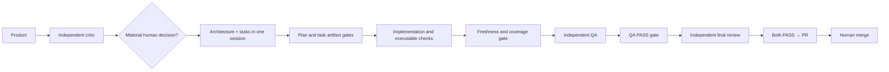

# Workflow 2.3.0 — applied optimizations

This update follows the [stage token audit](WORKFLOW_STAGE_TOKEN_AUDIT.md). The
measured nine-task sample put 64.30% of retained tokens in development and QA, and
37.06% in subsequent executions of those stages. Savings are not measured yet.

## Delivery



New runs have six agent sessions. Architecture invokes planning and task generation
in the same session, including their hooks and complete artifacts. Research now
targets concrete unresolved feature questions, rather than automatically surveying
every dependency or dispatching research agents for settled technology.

The [verification manifest](AGENT_VERIFICATION.md) binds requirements to executable
checks. Developer checks produce receipts with hashes and local output references;
the development gate rejects incomplete tasks, missing/failed output, stale inputs
and missing requirement coverage. This aims to prevent avoidable trips to QA.
Independent QA and review retain their own scope and PASS gates.

## Console and metrics

The default console shows stages, heartbeats and concise agent/check/token outcomes.
Agent prompts, reasoning, JSON payloads and tool output remain in local transcripts.
Human gate messages and input prompts, including partial writes without newline,
pass through. Noninteractive agents cannot consume piped gate answers. Cancellation
signals the isolated runner process group on POSIX; exits preserve interrupted state.

For explicit full console output:

```bash
AGENTFLOW_CONSOLE=full ./agentflow start TASK-NNN
```

Raw output may contain local runtime data. Full output is an opt-in diagnostic mode;
agents normally inspect bounded excerpts rather than rereading full logs.

The Codex bridge adds JSON output while forwarding existing models and permissions.
Stage labels come from explicit workflow markers; unmarked legacy prompts remain
`unknown`. The CLI's `thread.started` and `turn.completed` events provide available
token dimensions. See [official noninteractive documentation](https://learn.chatgpt.com/docs/non-interactive-mode).

```bash
./agentflow metrics TASK-NNN
```

Private `.agentflow/runs/TASK-NNN.metrics.jsonl` records task, stage, unique attempt,
elapsed time and available input/cache/output/reasoning/cache-write counters. Public
summaries omit prompts, commands, identities and private session hashes. Absent
dimensions stay null. Input plus output is the aggregation denominator; cache and
reasoning are not added again. Unknown counts and failed/incomplete attempts remain
visible. This measures retained CLI usage, not billing or the exact share of context.

Fresh single-turn `exec` reports have a local baseline. Reused/resumed sessions or
multiple terminal reports retain reported snapshots and arithmetic counter deltas,
but their incremental usage remains unknown because these logs do not establish
counter semantics. Decreases and missing baseline dimensions never become zero.
Aggregate percentages describe only events with known input and output. A custom
`SPECKIT_INTEGRATION_CODEX_EXECUTABLE` is preserved; it must emit compatible bridge
events to provide these metrics and bounded agent sections.

## Existing runs

Feedback now uses each saved workflow's step order and never replaces its snapshot.
Rewinding development keeps the already approved product gate; rewinding product
discards that active approval so changed decisions must pass the gate again. Earlier
unaffected artifacts remain intact. Legacy runs retain separate architecture/tasks
and their prior readiness requirements; new ones rewind combined planning together.

TASK-015's files and run snapshot were not migrated or resumed by this change. A
future resume uses its existing DAG; current runner logging applies, but new checks
and combined planning are not silently inserted. No fabricated feedback is needed.

## Validation and limits

Synthetic tests cover freshness/deletions/untracked files, input/output tampering,
failed checks, requirement and HTTP coverage, deferred verification tasks, summary
privacy, fragmented UTF-8 human prompts, stdin, nonzero pipeline exits, missing and
reused usage, legacy/current rewinds and preservation/invalidation of gate approvals.
The actual pipeline bridge was exercised with simulated Codex events and human
input, without spending tokens on a product run or publishing anything.

The modified skill is validated and both workflow definitions are synchronized.
Independent QA and final review record results in `specs/053-workflow-token-audit/`.
Application endpoint behavior did not change. Windows has a forwarding shim but
its process/gate behavior requires verification on Windows; executable mocks here
ran on POSIX. First real deliveries must measure savings and readiness false alarms;
tests cannot prove every future agent will follow context limits.
